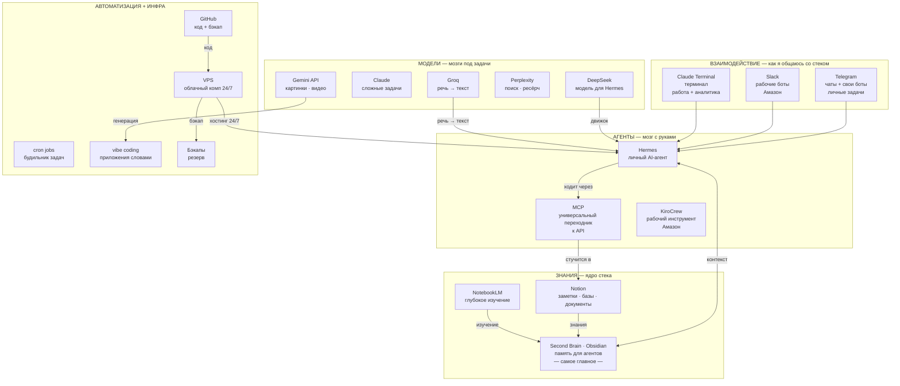

# AI-стек Азамата — карта для новичка

> Карта моего AI-инструментария, собранная так, чтобы её понял человек **без технического образования**.
> Сначала — базовые понятия простыми словами, потом — схема, потом — как всё связано.
> Редактируй свободно. Версия-картинка: `ai-stack.png` / `ai-stack.html`.

---

## 1. Понятия простыми словами (глоссарий)

Прежде чем смотреть на схему — вот что означают слова. Каждое — с аналогией из жизни.

| Термин | Что это простыми словами | Аналогия |
|---|---|---|
| **Модель (LLM)** | «мозг» — программа, которая понимает и пишет текст (а некоторые — картинки, видео, речь) | двигатель |
| **AI-агент** | «мозг + руки» — модель, которой дали инструменты, чтобы она не просто отвечала, а сама делала шаги | личный помощник |
| **API** | «розетка» — стандартный разъём, через который программы разговаривают друг с другом | розетка 220В |
| **MCP** | «универсальный переходник» — один разъём, чтобы агент ходил в любую программу без изучения сотен разных розеток | кабель USB-C |
| **Second Brain** | «память» — твои заметки и знания, которые агент читает перед ответом, чтобы отвечать в твоём контексте | записная книжка |
| **Терминал** | «окно команд» — место, где пишешь программе текстом, что делать | пульт управления |
| **cron** | «будильник» — расписание: запусти задачу в 9:00 каждый день | таймер |
| **VPS** | «арендованный компьютер в облаке» — чужой комп, который всегда включён и крутит твоих ботов | арендованная квартира |
| **vibe coding** | «собираешь приложение словами» — описываешь, что хочешь, а AI пишет код | диктовка строителю |

### Зачем API и зачем MCP (главное, что было непонятно)

**API** — это «дверь с правилами». Каждая программа (Notion, GitHub, Telegram) умеет делать свои действия, но просить её об этом нужно строго определённым способом. API и есть этот способ: «чтобы создать страницу в Notion, постучи вот так, и получишь ответ вот в таком виде».

**Проблема:** если агент хочет работать с 20 программами, он должен выучить 20 разных дверей.

**MCP (Model Context Protocol)** — это «универсальный переходник». Он сводит все двери к одному стандарту: агент говорит «создай страницу в Notion» одним и тем же способом, а MCP сам знает, как именно постучаться в дверь Notion.

**Зачем это тебе:** без MCP каждое новое подключение = ручная работа. С MCP агент подключается к новому инструменту «из коробки». Поэтому MCP стоит в центре моего стека.

---

## 2. Три главных принципа

1. **Second Brain — это память, которую видят агенты.** Без контекста агент — «болванка»: он не знает ни твоих задач, ни истории. Это самое главное в стеке.
2. **Не одна модель на всё, а правильная под задачу.** Одна лучше слышит речь, другая сильна в сложных задачах, третья рисует.
3. **AI ≠ автоматизация.** Где процесс понятен — просто ставишь cron (будильник), и LLM вообще не нужна.

---

## 3. Взаимосвязанная схема (Mermaid)

---

## 4. Пять слоёв подробно

### 1. Взаимодействие — как я общаюсь со стеком

| Инструмент | Что это | Зачем мне |
|---|---|---|
| Telegram | личные чаты + свои боты | вход в стек: отдаю команды агенту, боты под личные задачи |
| Slack | рабочие боты | то же, что Telegram-боты, но внутри работы в Амазон |
| Claude Terminal | Claude в терминале | основной рабочий AI (Амазон) + сложная аналитика и кодинг |

### 2. Агенты — «мозг с руками»

| Инструмент | Что это | Зачем мне |
|---|---|---|
| Hermes | личный AI-агент | центральный узел: принимает команды, зовёт инструменты — для личного использования |
| MCP | универсальный переходник к API | чтобы агент ходил в любую программу одним стандартом (см. раздел 1) |
| KiroCrew | рабочий инструмент в Амазон | удобный UI с выбором ИИ-моделей, режима рассуждения (reasoning) и автоматизаций; недавно релизнулся и теперь доступен всем |

> **Агенты и skills** — специальные навыки, которые расширяют агента под конкретные задачи (например, «умей читать PDF», «умей постить в Threads»). Это как дополнения-модули: подключил — агент научился новому.

### 3. Знания — ядро стека

| Инструмент | Что это | Зачем мне |
|---|---|---|
| **Second Brain · Obsidian** | память для агентов | **самое главное**: контекст. Без него агент бесполезен |
| Notion | заметки, базы, документы | для визуального чтения, редактирования и хранения — операционка (НЕ Second Brain) |
| NotebookLM | загружаешь документы → задаёшь вопросы | глубокое изучение материалов — для меня |

### 4. Модели — мозги под разные задачи

| Модель | Задача | Почему именно она |
|---|---|---|
| DeepSeek | модель для Hermes — мозг личного агента | хорошее соотношение цены и качества |
| Groq (Whisper) | речь → текст — расшифровка голосовых | быстрый и дешёвый транскрайбер |
| Claude | основной рабочий AI | силён в сложных задачах |
| Gemini API | картинки · видео | генерация изображений и роликов |
| Perplexity | поиск · ресёрч | ищет в интернете и даёт ответ с источниками |

### 5. Автоматизация + инфраструктура

| Инструмент | Что это | Зачем мне |
|---|---|---|
| cron jobs | будильник задач | автоматизация понятных процессов **без LLM** |
| vibe coding | собираю приложения словами | свои продукты (LuxFro и др.) |
| VPS | арендованный комп в облаке | всё крутится 24/7 |
| GitHub | репозитории | код + бэкап |
| Бэкапы | резервные копии | страховка от потери данных |

---

## 5. Как запрос проходит по стеку (сквозной пример)

Пишу в Telegram-бота: «найди мои заметки по проекту X и сделай сводку».

1. **Telegram** (дверь) принимает сообщение и передаёт его **Hermes**.
2. **Hermes** (агент) читает **Second Brain (Obsidian)** — чтобы понять, что такое «проект X» именно в моём контексте.
3. **Hermes** выбирает модель **DeepSeek** (движок) — для такой задачи она дёшевая и быстрая.
4. **Hermes** через **MCP** (переходник) стучится в **API Notion** → достаёт нужные страницы.
5. Ответ собирается и возвращается мне в **Telegram**.

Вот так пять слоёв связаны: дверь → агент → память → движок → переходник → инструмент.

---

## 6. Ключевые связи (по стрелкам)

1. **Telegram / Slack / Claude Terminal → Hermes** — все «двери» сходятся в агенте.
2. **Hermes ⟷ Second Brain** — главная связь: агент читает и пишет контекст.
3. **Notion / NotebookLM → Second Brain** — источники, питающие память.
4. **Hermes → MCP → Notion** — агент ходит в инструменты через универсальный переходник.
5. **DeepSeek → Hermes** — модель-«движок» под агентом.
6. **Groq → Hermes** — расшифровка голосовых в текст.
7. **Gemini API → vibe coding** — генерация для приложений.
8. **VPS → Hermes** — хостинг 24/7.
9. **GitHub → VPS → Бэкапы** — код и резерв.

---

## 7. Что я подправил и где остались вопросы

**Исправил:**
- Выпавшую строку «AGENT и skills» → вынес в отдельное пояснение под слоем 2.
- `vibe coding` пропал из таблицы 5 (остался на схеме) → вернул.
- `Amazon internal` и `KiroCrew` разошлись (в схеме оба, в таблице один) → объединил в **KiroCrew** как твой основной рабочий инструмент в Амазон.
- Добавил глоссарий + объяснение **API и MCP** на пальцах (твой главный вопрос).
- Добавил сквозной пример «как запрос идёт по стеку».

**Сверено (твои ответы):**
1. ✅ `Amazon internal` = `KiroCrew` — объединение верное.
2. ✅ `Agent и skills` = навыки-модули внутри агента.
3. ✅ DeepSeek = модель для Hermes; речь → текст делает Groq (Whisper).

---

## 8. Цветовая легенда (как в картинке)

- 🔵 голубой — взаимодействие
- 🟢 зелёный — агенты и оркестрация
- 🟣 фиолетовый — знания / Second Brain
- 🟡 жёлтый — модели
- 🟠 оранжевый — автоматизация
- ⚪ серый — инфраструктура

---

## 9. Для гайда «AI с нуля»

Эту схему показываем на **Уровне 3** (цель), а не в начале — чтобы новичок сначала прошёл азы:
- Уровень 0 — Claude/Perplexity, что такое GitHub, Obsidian (зародыш Second Brain)
- Уровень 1 — понятия без жаргона: терминал, репозиторий, агент, API, cron
- Уровень 2 — автоматизация: cron (без LLM), Telegram/Slack-боты
- Уровень 3 — вот эта схема целиком: Second Brain + MCP + модели + vibe coding

> TODO: разбить схему на 4 поста (по одному уровню) с мостом «я тоже с этого начинал».
