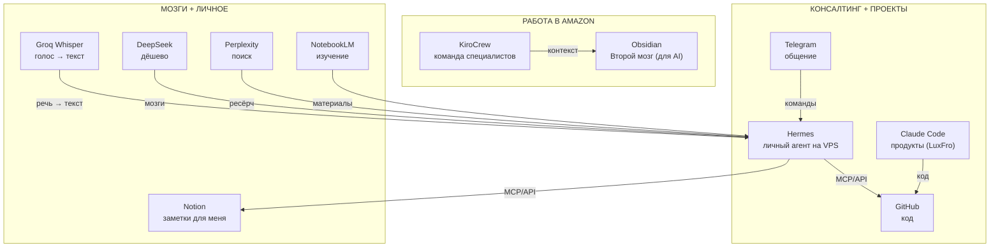

# AI-стек Азамата — как я делаю себя продуктивнее

> Не список инструментов, а логика: зачем они и под какие задачи собраны.

## Зачем всё это

Одна задача - сделать себя продуктивнее. Два эффекта:

1. **Делать рутину быстрее.**
2. **Делать то, что без этих инструментов я не смог бы вовсе.**

По сути это команда специалистов в кармане: data scientist, BI-инженер, аналитик, личный помощник. Апгрейд того, что я могу достичь, и апгрейд меня самого.

Логика всегда одна: **есть задачи -> под них строится решение -> под решение подбирается инструмент.**

## Три сферы жизни

Инструменты я строил вокруг трёх сфер:

1. **Работа в Amazon** - решаю сложные задачи, помогаю бизнесу принимать правильные решения.
2. **Консалтинг finazamat (B2B)** - и мои собственные проекты.
3. **Личные моменты** - жизнь, быт, обучение.

---

## Сфера 1 - Работа в Amazon

### KiroCrew - команда специалистов
Открытая мультиагентная среда: координирует задачи, помнит контекст проекта между сессиями, гоняет автоматизированные задачи на моём железе.

Что он делает: анализ сценариев, финансовый анализ, построение ботов, дашбордов и скриптов, автоматизация рутины.

Кого заменяет: data scientist, BI-инженер, аналитик и личный помощник.

### Obsidian - Второй мозг (для AI)
Хранит контекст того, над чем я работаю в Amazon. Помнит всё или почти всё, заметки лежат как в библиотеке.

Важный нюанс: эта библиотека не для меня - для AI. Чтобы ИИ знал мой контекст и отвечал в тему, а не с нуля.

---

## Сфера 2 - Консалтинг finazamat + свои проекты

### Hermes - личный AI-агент
Hermes - мой личный AI-помощник: программа, которая живёт на моём сервере и выполняет задачи по команде из чата.

Я посадил его на VPS (арендованный сервер), чтобы работал 24/7 и не зависел от моего компьютера. Общаюсь через Telegram - текстом и голосом.

Бонус: Hermes сам подключается к другим приложениям через встроенные коннекторы (MCP/API).

### Claude Code - разработка продуктов
Кодинг и сборка продуктов. Пример - LuxFro, сервис подготовки к экзамену по Люксембургу.

### GitHub - хранение кода
Как Notion для заметок, только для кода.

---

## Сфера 3 - Личные моменты + «мозги»

### Модели под задачи
- **DeepSeek** - китайский аналог GPT и Claude. Беру как «мозги», потому что дешевле.
- **Perplexity** - глубокие исследования в интернете.
- **NotebookLM** - когда нужно детально разобраться в материалах, изучить.
- **Groq (Whisper)** - транскрибация речи. Так я общаюсь с Hermes голосом.

### Notion - заметки и базы (для меня)
В отличие от Obsidian (который для AI), Notion - в первую очередь для меня: читать, вести, хранить.

---

## Как это связано (схема)

---

## Детали

### Понятия простыми словами

| Термин | Простыми словами |
|---|---|
| AI-агент (Hermes) | программа-помощник, которая сама выполняет задачи по команде |
| Мультиагентная среда (KiroCrew) | несколько таких помощников, которые делят работу между собой |
| Второй мозг (Obsidian) | библиотека заметок, которую читает AI, чтобы знать твой контекст |
| API | «розетка», через которую программы разговаривают друг с другом |
| MCP | универсальный переходник: агент ходит в любую программу одним стандартом |
| VPS | арендованный сервер, который работает 24/7 |
| Транскрибация (Groq) | перевод речи в текст |

### Зачем API и MCP

Каждая программа (Notion, GitHub, Telegram) говорит на своём языке. API - это «дверь с правилами», как к ней постучаться. MCP - переходник, который сводит все двери к одному стандарту: агенту не нужно учить 20 разных дверей, он стучит через одну.

### Фон (невидимая часть)

- VPS - на нём живёт Hermes (круглосуточно).
- cron - регулярные задачи без AI, по расписанию.
- бэкапы - резервные копии всего.

---

## Для гайда «AI с нуля»

Порядок рассказа новичку повторяет эту же логику:

1. **Зачем** - рутина быстрее + то, что не мог бы сделать (команда в кармане).
2. **Три сферы** - работа / консалтинг и проекты / личное.
3. **Инструменты под задачи** - по одной сфере за раз, от простого к сложному.
4. **Детали** - MCP/API, VPS, как всё соединено.

> TODO: разбить на посты по сферам, каждый с мостом «как я к этому пришёл».
