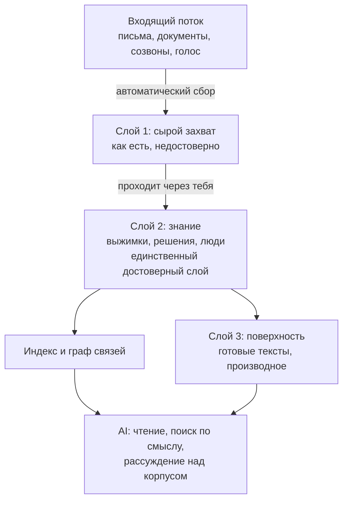

# Второй мозг для AI: общая архитектура

Это описание **общего подхода**, не моей конкретной конфигурации. Без имён файлов, путей и
рабочего содержимого. Смысл в том, чтобы показать, из каких частей вообще состоит второй мозг,
который читает AI, и почему без структуры он не работает.

## Идея в одном абзаце

Второй мозг это цифровой слой твоей работы, который читает не человек, а модель. Задача не в том,
чтобы тебе было удобно перечитывать записи, а в том, чтобы AI знал твой контекст и отвечал по
делу. Отсюда все решения ниже: они оптимизированы под чтение машиной, а не под твой глаз.

## Первое решение принимается до выбора инструмента

Люди начинают с приложения и потом не знают, чем его наполнить. Правильный порядок обратный:
сначала определи входящий поток, потом выбирай, где он будет лежать.

Входящий поток это то, что и так производится твоей работой:

- переписка и письма;
- документы и материалы по проектам;
- созвоны и встречи, расшифрованные в текст;
- голосовые заметки, надиктованные на ходу;
- твои собственные выводы и решения.

Чем больше из этого попадает внутрь автоматически, тем живее мозг. Ручное перепечатывание
выдыхается через две недели, автоматический сбор работает годами.

## Три слоя, и это главное

Папка со всеми заметками это склад. Модель достанет из неё случайное, потому что не отличит
черновик от решения. Работает разделение по зрелости содержимого.

**Слой 1, сырой захват.** Всё, что прилетело извне, как есть: письма, расшифровки, выгрузки,
случайные мысли. Здесь не наводят порядок. Этот слой не считается достоверным.

**Слой 2, знание.** То, что прошло через тебя: выжимки, решения, статусы проектов, договорённости,
люди и их роли. Здесь один факт живёт в одном месте, и на этот слой опирается модель, когда
отвечает. Это единственный слой, который считается достоверным.

**Слой 3, поверхность.** Готовые тексты: справки, черновики, отчёты, ответы. Производное от
второго слоя, его можно удалить и собрать заново.

Разделение важнее аккуратности внутри слоёв. Оно даёт модели понять, чему верить.

## Связи вместо одной только поисковой строки

Поиск по словам находит документ. Связи между записями находят **контекст**. Если заметка о
проекте ссылается на людей, решения и предыдущие итерации, модель может пройти по этим ссылкам и
собрать картину, а не выдать один абзац.

Практически это значит: ставь ссылки между записями сознательно, и держи в каждом крупном разделе
одну входную заметку, которая объясняет, что здесь лежит и с чего начинать.

## Как из него достают

Три режима, от дешёвого к дорогому:

1. **Прямое чтение** нужной записи, если ты знаешь, где она.
2. **Поиск по смыслу** по всему корпусу, когда не знаешь точного названия.
3. **Рассуждение над корпусом**: модель собирает несколько записей, проходит по связям и
   отвечает на вопрос вида «почему мы так решили» или «что сейчас блокирует».

Третий режим и есть причина, по которой всё это строится. Первые два дают поиск, третий даёт
ответ.

## Что должно происходить по расписанию

Второй мозг мёртв без фонового обслуживания. Минимум:

- разбор входящего потока в слой захвата;
- обновление поискового индекса, иначе новые записи не находятся;
- пересборка графа связей;
- периодическая проверка, что процессы вообще выполняются (иначе тихо отвалившийся сбор
  обнаруживается через недели);
- резервные копии.

Большинству этих задач AI не нужен вовсе, хватает скрипта по таймеру.

## Схема

## Когда этого делать не надо

Честная половина вопроса. Второй мозг не нужен, если:

- твоя работа не оставляет цифрового следа, собирать нечего;
- ты надолго сосредоточен на одной задаче, контекст держится в голове сам;
- хранить дольше недели нечего.

В этих случаях получится ещё одна заброшенная папка, и лучше признать это до, а не после.

## Что стоит решить до старта

1. Чем кормим: перечисли реальные источники, а не желаемые.
2. Что попадает автоматически, а что руками. Ручного должно быть мало.
3. Как разделены слои и какой из них достоверный.
4. Где граница между рабочим и личным. Смешать легко, разделить потом больно.
5. Что запускается по расписанию и как ты узнаешь, что оно перестало работать.
